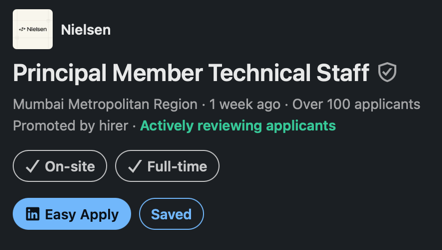

# Goal

- creating new workspaces for the JD's mentioned in this file.
- use a workflow for each job & each workflow should cap at 3 agents

# The Nielsen Company

- No need to create a resume here since the application has already been sent via Naukri

## Email

Hi Abhisheik Deo,

We’d like to consider you for employment at The Nielsen Company. Your privacy is important to us, so please review our privacy notice and confirm 
that we may use your information for recruiting purposes. If you do nothing, your profile will be deleted in 30 days.

The above email was sent along with a call from "Deepti Adlakha" (99534 08198)

I didn't get any JD, so I searched on LinkedIn and found the following information

## URL

https://www.linkedin.com/jobs/view/4466271472

## Job Description

About the job
Company Description

At Nielsen, we are passionate about our work to power a better media future for all people by providing powerful insights that drive client decisions and deliver extraordinary results. Our talented, global workforce is dedicated to capturing audience engagement with content - wherever and whenever it’s consumed. Together, we are proudly rooted in our deep legacy as we stand at the forefront of the media revolution. When you join Nielsen, you will join a dynamic team committed to excellence, perseverance, and the ambition to make an impact together. We champion you, because when you succeed, we do too. We enable your best to power our future.

Job Description

Gracenote is the content business unit of Nielsen that powers the world of media entertainment. Our metadata solutions help media and entertainment companies around the world deliver personalized content search and discovery, connecting audiences with the content they love. Weʼre at the intersection of people and media entertainment. With our cutting-edge technology and solutions, we help audiences easily find TV shows, movies, music and sports across multiple platforms. As the world leader in entertainment data and services, we power the worldʼs top streaming platforms, cable and satellite TV providers, media companies, consumer electronics manufacturers, music services and automakers to navigate and succeed in the competitive streaming world. Our metadata entertainment solutions have a global footprint of 80+ countries, 100K+ channels and catalogs, 70+ sports and 100M+ music tracks, all across 35 languages.

Responsible for driving Technology & good practices in Engineering in their respective teams.
Partner with the Product team to translate vague business requirements into concrete, feasible technical roadmaps.
Actively participate in development along with team members for as much as 60% of their time, creating modules & systems that can then be treated as a working reflection of the best practices.
Cross-System Integration ensuring data flow seamlessly & consistently across ingestion, processing and data deliveries to end customers.
Work closely with Data Science, DevOps, and Frontend architects to ensure our backend infrastructure supports emerging needs.
Being responsible for Scaling, Performance & Quality.
Experiment with new & relevant technologies and tools, and drive adoption while measuring yourself on the impact you can create.
Implementation of long-term technology vision for your teams.
Creating architectures & designs for new solutions around existing and new problem spaces.
Responsible for the architecture of your platform; ensuring it is aligned to the long term requirements and the platform vision.
Drive technology & tool choices for your team & be responsible for them.
Drive technology forums & rhythms in the team to drive best practices. Establish organization-wide engineering standards (coding guidelines, API contracts, security protocols, design standards) to ensure consistency across different teams.
Mentor and guide Senior engineers, fostering a culture of learning and collaboration within the team.
Going beyond your role and contributing to make the organization & business better.

Qualifications

Experience & Education

Bachelorʼs degree in Computer Science, Engineering, or a related field.
15+ years of professional experience in software engineering, with a proven track record of designing, developing, and scaling complex, enterprise-grade applications from scratch.

Core Backend & Architecture

Backend Expertise: Advanced proficiency in Java, Scala, or Python ecosystems optimized for high-throughput, low-latency workloads (Familiarity with languages like Rust, Golang for performance critical components & services is a strong plus).
Distributed Systems: Deep expertise in microservices architecture, RESTful API design, Domain-Driven Design (DDD), and building highly available, fault-tolerant, resilient systems.
Event-Driven Design: In-depth knowledge of asynchronous communication, messaging queues, and event-driven architectures.
Full-Stack Awareness: Familiarity with front-end technologies (e.g., HTML, CSS, JavaScript) is preferred.

Data Engineering

Data Architecture: Strong command of distributed data architectures, data engineering constructs, and building scalable data pipelines, including expertise in both real-time streaming and batch processing paradigms (e.g., Lambda or Kappa architectures).
Datastores: Deep understanding of designing, scaling, and optimizing a variety of datastores across both SQL and NoSQL.
AI/ML Foundations: Working knowledge of machine learning and data science concepts to effectively integrate ML models and data workflows.

Cloud, Infra & DevOps

Cloud Platforms: Extensive hands-on experience designing for cloud environments (primarily AWS), leveraging cloud-native platform constructs, and driving cost-efficient architecture (FinOps).
Containerization: Proficiency with containerization and orchestration technologies (e.g., Docker, Kubernetes).
Observability & Reliability: Deep understanding of system observability, distributed tracing, telemetry, and establishing robust monitoring for large-scale production systems.
Engineering Excellence: Strong knowledge of CI/CD tools and practices. Proven experience with Test-Driven Development (TDD) and automated testing frameworks to ensure system reliability.

Leadership & Execution

Process Champion: Standard-bearer for modern SDLC practices, understanding of software development methodologies (Agile, Scrum, etc.), and infrastructure management.
Autonomy & Problem Solving: Exceptional problem-solving skills with the ability to navigate architectural ambiguity, work highly independently, and elevate a team environment.
Communication: Excellent communication and interpersonal skills to mentor senior engineers, collaborate with cross-functional stakeholders, and drive technical alignment.

Additional Information

Please be aware that job-seekers may be at risk of targeting by scammers seeking personal data or money. Nielsen recruiters will only contact you through official job boards, LinkedIn, or email with a nielsen.com domain. Be cautious of any outreach claiming to be from Nielsen via other messaging platforms or personal email addresses. Always verify that email communications come from an @nielsen.com address. If you're unsure about the authenticity of a job offer or communication, please contact Nielsen directly through our official website or verified social media channels.

