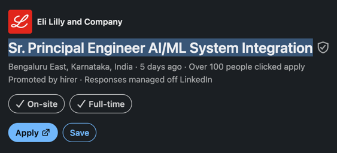
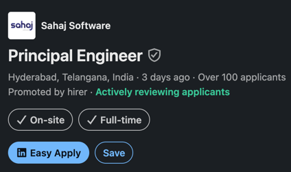

# Goal

- creating new workspaces for the JD's mentioned in this file.
- use a workflow for each job & each workflow should cap at 3 agents

# Eli Lilly and Company

## URL

https://www.linkedin.com/jobs/view/4470913095/

## Role

Sr. Principal Engineer AI/ML System Integration

# Job Description

About the job
At Lilly, the work is demanding because patients are waiting. We unite caring with discovery to help make life better for people around the world, knowing that every decision, every detail, and every day matters. Headquartered in Indianapolis, Indiana, our over 50,000 employees around the globe take on complex challenges to discover and deliver life-changing medicines, strengthen how health is understood and managed, and support the communities we serve. This is hard, urgent, selfless work—but it’s work worth doing. If you’re driven by purpose and ready to bring your best to work that truly matters for patients, we invite you to join us.

Role Overview

We are seeking a Sr. Principal Engineer to lead the architecture and integration of AI/ML-enabled applications across enterprise platforms, data ecosystems, commercial workflows, and third-party services. This role owns the technical integration strategy that brings together business applications, APIs, data products, machine learning models, large language models, agents, security controls, and human workflows into secure, resilient, observable, and scalable solutions.

This is a senior individual contributor and cross-team technical leadership role. The successful candidate will partner with product managers, AI/ML engineers, software engineers, data teams, platform owners, enterprise architects, cybersecurity, privacy, compliance, vendors, and business stakeholders to deliver end-to-end AI-enabled capabilities

Key Responsibilities

Enterprise & AI Solution Architecture

Lead architecture and integration strategy for AI/ML-enabled products and platforms.
Design scalable solutions that integrate applications, APIs, data platforms, AI services, and business workflows.
Establish reusable integration patterns, architecture standards, and technical governance practices.

AI Platform & Application Integration

Integrate AI/ML capabilities, LLMs, RAG solutions, agents, and analytics services into enterprise applications.
Guide technical decisions regarding model usage, orchestration, workflow automation, and human-in-the-loop controls.
Ensure solutions are secure, resilient, observable, and operationally supportable.

Data, Platform, and Cloud Integration

Design and govern data flows across operational systems, data platforms, semantic layers, and AI services.
Partner with platform and engineering teams to enable scalable cloud-native architectures and deployment models.
Ensure data quality, security, lineage, and compliance requirements are addressed.

Quality, Governance & Operational Excellence

Establish end-to-end testing, monitoring, observability, and AI evaluation practices.
Promote Responsible AI principles, security-by-design, and privacy-by-design approaches.
Drive production readiness, operational support models, and continuous improvement practices.

Technical Leadership

Serve as a trusted technical advisor to product, engineering, architecture, security, and business stakeholders.
Lead architecture reviews and influence technical strategy across multiple initiatives.
Mentor engineers and architects while promoting engineering excellence and knowledge sharing.

Required Qualifications

8+ years of experience in software engineering, solution architecture, systems integration, or platform engineering.
Experience architecting and delivering complex enterprise solutions integrating multiple systems, platforms, and data sources.
Strong understanding of cloud-native architecture, APIs, microservices, event-driven systems, and integration patterns.
Experience with AI/ML-enabled applications, including LLMs, RAG, agentic workflows, or related technologies.
Experience with cloud platforms such as Azure, AWS, or GCP.
Familiarity with MLOps, LLMOps, DevSecOps, and modern software delivery practices.
Strong communication, stakeholder management, and technical leadership skills.

Preferred Qualifications

Experience in healthcare, life sciences, commercial analytics, CRM, field engagement, or customer engagement platforms.
Experience with Databricks, Azure AI, Azure OpenAI, AWS AI/ML services, or similar enterprise AI platforms.
Experience with semantic search, vector databases, knowledge graphs, or agent-based architectures.
Experience with enterprise architecture, technical governance, and vendor management.

Key Skills

Enterprise Integration Architecture
AI/ML & Generative AI Solutions
Cloud & Platform Architecture
API & Event-Driven Design
Data & Knowledge Integration
Agentic AI & Workflow Orchestration
MLOps / LLMOps
Responsible AI & Governance
Architecture Leadership
Stakeholder & Vendor Management

Lilly is dedicated to helping individuals with disabilities to actively engage in the workforce, ensuring equal opportunities when vying for positions. If you require accommodation to submit a resume for a position at Lilly, please complete the accommodation request form (https://careers.lilly.com/us/en/workplace-accommodation) for further assistance. Please note this is for individuals to request an accommodation as part of the application process and any other correspondence will not receive a response.

Lilly does not discriminate on the basis of age, race, color, religion, gender, sexual orientation, gender identity, gender expression, national origin, protected veteran status, disability or any other legally protected status.

#WeAreLilly

# Sahaj Software

## URL

https://www.linkedin.com/jobs/view/4470146279/

## Role

Principal Engineer

## Job Description

About the job
Let’s decode thisWe're not looking for someone who has "been around for 14+ years". We're looking for someone who has raised the bar for ten years.
raises_bar(team) → The people around you write better code because you are there. You mentor through pairing and feedback, not hierarchy.
depth >= LEGENDARY → You have gone deep enough to hold strong opinions, and humble enough to change them.
ships_code → You still build. Regularly. In production.

This role isn’t for everyone. It’s for engineers who want to stay close to the code, go deep, and do meaningful work. If that sounds like you - Apply.
What the work looks likeWe can't promise which problem you'll pick up, but the menu right now looks something like this:
Redesign a ClickHouse schema so an ad buyer can query 85 billion rows in under two seconds, and discover that pre-exploding the rows 168x is actually the right answer.
Keep a vehicle telemetry platform moving billions of messages a day without the Kafka consumers falling over.
Build the engineering spine of a mobile wallet used by more than two billion people across four continents.
Ship the data product behind peer-review submissions for one of the world's largest scientific publishers.
The list changes every quarter. The pattern doesn't: data-heavy, distributed, and often sitting on top of something that already exists and isn't perfect.
What you will actually do
Design and build systems that deal with real-world complexity (not toy problems)
Write production code frequently, not just review or direct
Work across languages when needed, not just your comfort zone
Break down messy problems into clean, maintainable systems
Push back on bad ideas, including ours
You won’t be:
A people manager
A “review-only” architect
Someone removed from the code

How we think about engineeringWe care about:
Code that is simple, testable, and built to change
Engineers who can explain their design decisions clearly
TDD, refactoring, and continuous improvement - not as rituals, but as tools
Choosing the right technology, not the fashionable one
We don’t care much about:
Buzzwords
Framework loyalty
Whether you’ve used our exact stack before

Tech (context, not a checklist)Java, Scala, Python, Kotlin, Go, Elixir, .NET, Node.js, TypeScript, RustYou don't need to have shipped all of these. You do need the ability to learn what the problem demands.
What you’ll get
A place where Principal Engineers still write code - daily
One designation across the company: **Solution Consultant**. "Principal Engineer" is the translation for the outside world
Small teams, high ownership, large impact, minimal process overhead
No reporting managers. Decisions happen where the code does
Find your balance between work and life’s ups and downs with unlimited leave when you really need it
**Open salaries.** Inside Sahaj, every Sahajeevi can see every other Sahajeevi's pay, including the founders'. The annual hike is voted on collectively in a room where the whole company reads the P&L
Own what you build. When Sahaj grows in impact and value, you’ll have a share in that upside

Requirements added by the job poster

• 8+ years of experience in Engineering

