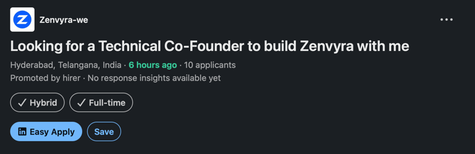

# Goal

- creating new workspaces for the JD's mentioned in this file.
- use a workflow for each job & each workflow should cap at 3 agents

# Zenvyra-we

## URL

https://www.linkedin.com/jobs/view/4471703455/

## Role

Technical Co-Founder

## Job Description

About the job
I’m not looking for a developer. I’m looking for someone who wants to build a company with me.
I’m building Zenvyra a business that helps companies grow through websites, apps, AI agents and automations.
I’m looking for a Technical Co-Founder who has strong practical knowledge of:• Website & web application development• Mobile app development• AI agents• Business automations• n8n, APIs and integrations• Building and launching real products
I’ll take care of:• Marketing• Sales & client acquisition• Social media & content• Business development• Brand building
What I’m looking for in my co-founder:🔥 Strong technical skills🔥 Hunger to grow the business🔥 Takes ownership and responsibility🔥 Problem-solving mindset🔥 Willing to learn and experiment🔥 Long-term commitment🔥 Thinks like a founder, not just a developer
Language requirements:• Telugu — must know• English — must knowThis is a co-founder opportunity, not a regular job. I’m looking for someone who genuinely wants to build Zenvyra, take risks, solve problems and grow the business together.
If you’re interested, DM me with:
Your technical skills
Projects you’ve built
Your experience with AI agents & automation
Why you want to become a co-founder

Let’s build Zenvyra together.

