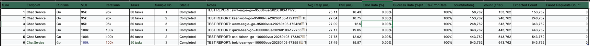

# Goal

- the goal here is to map my professional journey & talk about the most important projects, etc during that time.
- expected output: a nice narration with questions anticipated, recommended options given and answers provided for those conversations.

# LyntonWeb April 2007 - April 2008

## .NET Developer was my role

- .NET application
- SQL Server 2005
- Mexican Paypal
- goal was to build a online portal that'll connect suppliers and buyers
- windows service that'll take invoices located in a particular folder and upload them to the server so that eventually everyone uses the portal

# El Paso Corporation (April 2008 - May 2012)

## Senior Java Developer

- Java running in Citrix had to be rewritten using JSP/J2EE
- TGP (Tennessee Gas Pipeline) which was perhaps the second largest pipeline in US or even the world. research about TGP regarding the monthly 
  revenue flow.
- Nominations, Flowing Gas, Contracts were the module I'd worked on. research about this
- SQL Server 2000 to SQL Server 2005 migration
- SP optimisation
- SP writing
- DB Design

# McDonald's Corporation (June 2012 - May 2013)

## Software Architect

- MDM (Master Data Management). Pilot was North America (USA & Canada).
- take employee information from ALL the McDonald's stores and give a single unified view to the leadership
- used the builtin MDM tool in SQL Server but the UI wasn't supportive enough
- re-designed the UI to show the records properly to the leadership team
- Also, metadata for master data. eg., for a given employee record when was each field first seen, last updated, etc

# innRoad (July 2013 - May 2015)

## Technical Lead

- Worked on modernizing an existing ASP.NET app using SPA
- Used Angular for front-end
- .NET WCF for backend
- Optimised stored procedures, table design, indexing, for achieving better performance
- screens lading time was improved by 60-70% due to the re-architecture and 

# Cura (May 2015 - November 2015)

## Technical Architect

- Biggest issue was cost on the customer due to Windows Server & SQL Server license
- gave a Ubuntu deployment in Node along with MySQL migration of schema for new enterprise customers only. this way we acquired 12 new customers 
  in October & November 2015

# Teletext India Pvt. Ltd 

## Senior Software Engineer

### Situation

#### First Problem

- a customer looks at their website at a particular property & decides to call a number
- the number is routed to a sales rep
- the sales rep sees the same property & the rate shown to the customer
- the sales rep needs to now check 25-30 suppliers to get hotel information in the area matching the customers area of interest
- written in .NET 2.0 but the previous team failed to update this to .NET 4.0.
- SQL Server was in use
- I came in with my knowledge of MuleSoft's Anypoint platform. Implemented Scatter Gather pattern to parallely call the configured suppliers and 
  get the prices and display that to internal users.

#### Second Problem

- Teletext Holidays relied on artirix to get hotel prices that were displayed to customers
- based on the customers load, artirix charged us for the infrastructure
- at peak, we served 2-3 million requests per day
- Goal: to bring artirix in-house & directly call the suppliers for rates. this way we can save a lot on money.
- High Level Implementation: a request comes in from a user that has "airport", "destination", "start-date", "end-date". if we do not have this in 
  our Elastic Search cache, we call the supplier's endpoint and serve it to the users & cache it. subsequent requests will be served from the 
  cache. added a 20 minute TTL for each such document. implemented filtering, sorting, etc. also, business logic of showing preferred hotels at 
  the top if they were returned in the result set. preferred hotels were those hotels that Teletext had a direct contract with

### Third problem

- each supplier had a different ID for each hotel
- now, when we search the suppliers for a particular destination and if the hotel id in the response isn't mapped on our end then we don't show it.
  we don't show it since the static data like images, description, ratings, etc isn't present in our system. there's a very high possibility that 
  we already have the hotel but with a older hotel id or we haven't refreshed our database with the new supplier information.
- Use GAITA to reconcile this list which helped increase the revenue by 8% month on month.
- automated the same using AWS Lambda. Approval was still with me

# Voltuswave

## Co-Founder & VP of Technology

- No Code Platform
- scaled the team from 0-35
- gave the architectural roadmap for the subsequent products to work from

# Rocket Software

## Software Engineer III

### Goal

- Configuration Manager for DB2 on z/os & LUW - this tool was a part of a bigger tool Data Server Manager. I might be getting the names wrong here.
- Spring Boot & Java
- decomposing the existing monolith into microservices by defining the boundaries

# Deque Software

## Technical Architect / Staff Software Engineer / Tech Lead

Three products

### Initial State

#### axe Monitor

- problem it solves: we've an enterprise like fedex that needed to get an idea of their accessibility compliance on their global website. their 
  main problem is the person/team responsible for website a11y has no idea how many pages are present, when will the content change, when will 
  URL's be added/removed/updated, etc. axe Monitor solved this problem by running a spider on the starting URL , finding out the URL's and for 
  each URL, run axe-core to get the violations and report it back to the user. showing the progress of the scan. scheduling scans. scan would've a 
  configuration of number of levels from the starting URL. 1/2/3/4/5/ALL URL's. comparing the progress across scans. giving a actionable report to 
  the leadership team to focus on problem areas. giving a report at a developer level as well so that they can fix issues quickly. 
- deployment model: one environment per customer. the environment has two EC2 instances. one instance was the web server whilst the second 
  instance was a analytical server that ran the jobs. Preferred: RHEL/Rocky Linux, PostgreSQL. we also supported windows server, any flavour of 
  linux/unix, MS SQL Server, MySQL, Maria DB. each deployment had their local keycloak instance. each keycloak instance had PostgreSQL as their 
  backend database

#### axe Auditor

- problem it solves: gives complete report of a11y compliance. two models: companies can come to deque & give a bunch of URL's & ask for a11y 
  report against WCAG 2.2 Level AA. we run automated issues using axe core as well as manual testing of the URL's. e.g., Dominos came to deque 
  with 10 URL's that needed to be assessed. we delivered the report via a axe auditor URL. this shared instance was used for services. second 
  model was wherein we setup a axe Auditor instance to a customer. e.g., <cust-name>-axe-auditor.dequecloud.com
- deployment model: single docker compose file that had 3 node js processes, nginx, postgresql (9.6), keycloak.
- tech stack: javascript, massive js, pug/jade

### axe Devtools browser extension

#### first feature implemented

- user navigates to a URL to test for a11y.
- user opens the Devtools browser extension
- navigates through URL's that they want to test.
- the browser detects user actions, URL changes, etc, runs axe core and saves the results
- the user can then name this run & save the issues along with the URL's tested 
- the server side with de-duplicate the issues and save it
- we can compare runs as well to get an idea of what changed

#### second feature implemented

- when the page has cross origin iFrames embedded in the URL, axe Devtools Extension wasn't able to find issues in those cross origin iFrames.
- implemented the first phase of this feature.

### Final Stage for axe Monitor & axe Auditor

- moved to a centralized auth service for ALL products across ALL enterprises. this supports individual users as well.
- added a microservice for billing & subscription that worked across ALL products
- axe Monitor was moved to a multi tenant architecture so that we can reduce the number of instances which will help in maintainence, onboarding a 
  new customer, setting up eval instances, etc. we still had customers like banks that had their own environment but they were very few. on prem 
  installation continued as is.
- axe Auditor was moved to a multi tenant architecture as well. 
- axe Auditor moved from PostgreSQL 9.6 to Aurora PostgreSQL 13.x for ALL instances without any downtime.
- both axe Auditor & axe Monitor spoke to the auth & billing/subscription service
- Auditor supported single users. e.g., i could pay $20 per URL to get a comprehensive a11y report
- added Datadog & Amplitude to both Monitor & Auditor
- Let's focus the narration on axe Monitor itself.

# Voltuswave second stint

## VP of Technology / Senior Principal Architect

### Initial Situation

#### Goal:

- add AI to get investors
- for adding AI, we needed patients on the platform
- for adding patients, we needed to make the platform reliable
- for making the platform reliable, needed to find out what the issue(s) were
- also, the platform of choice was https://periskope.app/ . we needed to move patients & internal staff to our app.
- we needed to scale the platform to support 100k concurrent users.

#### About the platform

- chat based application
- "hospital on the cloud" is the tagline
- constructs present. Room, Service Tree, Service, Pools
- how are they related? Room Config could have several service trees. each service tree could have several services. each service is associated to 
  a service pool
- Room Config is also known as offering.
- Flow: a patient purchases a subscription against a previously defined offering/room config. based on the room config, for each service a 
  specific staff member is chosen and added to the room. now, this room is an instance of the room config. there are rules to select members for 
  each service from their associated service pools. like language, location, specialities, etc. 
- Eg., DRP (Disease Reversal Program) is a room config/offering has 5 service trees. Treating Doctor (TDR), Intake Doctor (IDR), Health Coach (HC),
  Guidance Counsellor (GC) & Patient. TDR has 5 levels: TDR_L1, TDR_L2, TDR_L3, TDR_L4, TDR_L5. each of these is a service defined in the config. 
  Similarly, IDR has 5 levels. HC has 7 levels, HC_1, HC_1.5, HC_2, HC_2.5, HC_3, HC_4 & HC_5. Patient has only one single level.
- if a patient sends a message, what does that translate to:
- inserting into `pms-chat` dynamodb table
- checking `pms-user-rooms` open search for room membership
- for each room member, we need to update their record with `lastMessageReceived`, `lastMessageTimeStamp`, `greenDotCount`. `greenDot` is referred 
  to as an unread message
- now for each member we need to fan out the notifications. remember, each member can have multiple tabs open, mobile devices available, etc
- also, the endpoint will insert this message into a SQS which will invoke a Lambda. this lamda will append this message to an S3 object. this S3 
  object was what was used to render the chat on both web & mobile. search was implemented on client side.
- so, a single message will result in 50 external calls.

#### What was done?

- make the platform reliable by introducing Datadog. reduced the error to < 3% in production
- onboarded users to our app instead of https://periskope.app/. 10k+ patients were onboarded
- GO Chat Service v2.0 gave me the ability to scale to 100k concurrent users. 
- I still wasn't happy since I wasn't sure what'll happen if we get a spike.
- So, worked on the 2 stream architecture as well that gives me a lot of headspace. Didn't have the budget to test the limits of this 2 stream 
  architecture. you can find it them  & 

- [killer-query-impl-for-amura-voltuswave](killer-query-impl-for-amura-voltuswave) has the Killer Query implemented for Amura/Voltuswave
